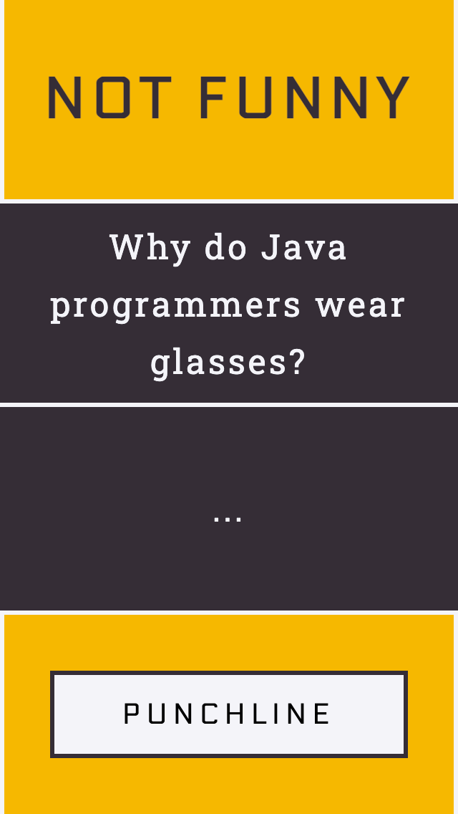
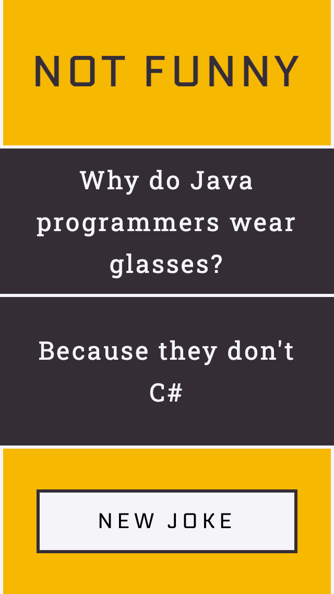

# not funny

## Brief
Simple API Experiment using the official_joke_api (linked below).

## Links
- API: https://github.com/15Dkatz/official_joke_api
- Code: https://github.com/ruairiconway/not-funny
- Live: https://ruairiconway.github.io/not-funny/

| setup | punchline |
| ---- | ---- |
|  |  |

## Highlights
- Demonstrates use of Asnyc / Await functions
- Demonstrates use of simple fetch GET method
- Responsive + Accessible Design

## Future Edits
- Site styling
- Loading screen/effect while fetch runs